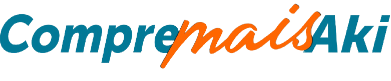

<h1 align="center">
    
</h1>

  <a href="#-tecnologias">Tecnologias</a>&nbsp;&nbsp;&nbsp;|&nbsp;&nbsp;&nbsp;
  <a href="#-projeto">Projeto</a>&nbsp;&nbsp;&nbsp;|&nbsp;&nbsp;&nbsp;
  <a href="#-layout">Layout</a>&nbsp;&nbsp;&nbsp;|&nbsp;&nbsp;&nbsp;
  <a href="#memo-licença">Licença</a>

 

  

 

  

## 🚀 Tecnologias

Esse projeto foi desenvolvido com as seguintes tecnologias:

- [ASPNET Core](https://docs.microsoft.com/en-us/aspnet/core/tutorials/first-web-api?view=aspnetcore-5.0&tabs=visual-studio)
- [React](https://reactjs.org)
- [React Native](https://facebook.github.io/react-native/)
- [Expo](https://expo.io/)
- [TypeScript](https://www.typescriptlang.org/)

## 💻 Projeto

O CompreMaisAki é uma aplicação que conecta pessoas às empresas Associadas neste sistema, facilitando o consumo da cidade.

## :memo: Licença

Esse projeto está sob a licença MIT. Veja o arquivo [LICENSE](LICENSE.md) para mais detalhes.

---

Feito by Habil Informática :wave: [Veja nosso site!](http://www.habilinformatica.com.br/)

## PROTÓTIPOS.

Alfa Test 07/12/2020

Alfa Test 22/03/2021

APK + Alfa Test 06/04/2021

APK + Beta Test 01/05/2021

## ALPHA

0.0.2 = 07/01/2021

0.0.3 = 21/01/2021

v1 = 19/02/2021

v1.0.2 = 06/04/2021

## BETA

V1 06/07/2021

V2 20/08/2021

